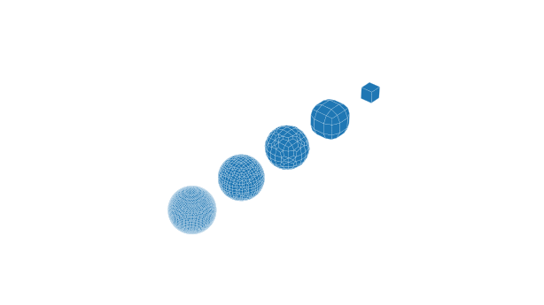
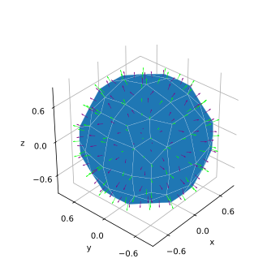
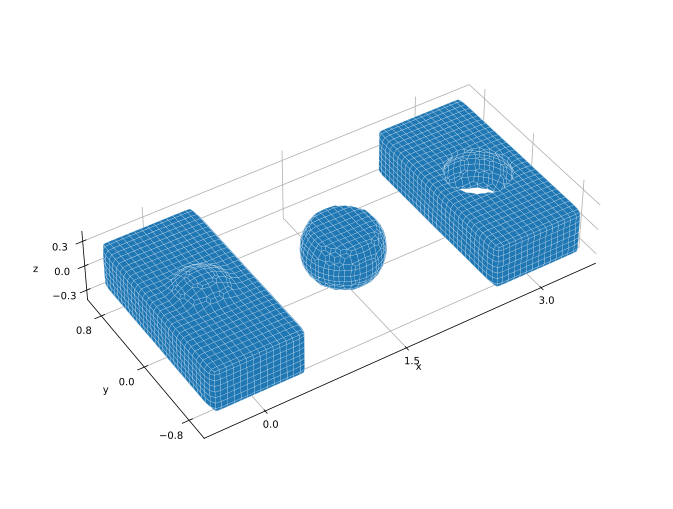

# sdf-surfacenets

This repository provides a vectorized Python implementation of (naive) SurfaceNets for the problem of isosurface extraction from signed distance fields (SDF).

<div align="center">

</div>

The image above shows two reconstructions of a sphere displaced by waves. The reconstruction on the left uses SurfaceNets from this library, the right side shows the result of applying Marching Cubes algorithm from scikit-image.

See [examples/compare.py](examples/compare.py) for details.

## Features

-   A vectorized SurfaceNets implementation based on numpy
    -   Midpoint and naive surface point placement
    -   Quad/Triangle support
    -   Vertex/Face normal support
-   Tools for programmatically creating and modifying SDFs
-   Plotting support for reconstructed meshes using matplotlib
-   Exporting (STL) of tesselated isosurfaces

## Example Code

```python
# Main import
import surfacenets as sn

# Setup the snowman-scene
scene = sn.sdfs.Union(
    [
        sn.sdfs.Sphere.create(center=(0, 0, 0), radius=0.5),
        sn.sdfs.Sphere.create(center=(0, 0, 0.6), radius=0.3),
        sn.sdfs.Sphere.create(center=(0, 0, 1.0), radius=0.2),
    ],
    alpha=8,
)

# Get some sampling locations
xyz, spacing = sn.sample_volume()

# Evaluate the SDF
sdfv = scene.sample(xyz)

# Extract the surface using quadliterals
verts, faces = sn.surface_nets(
    sdfv,
    spacing=spacing,
    vertex_placement_mode="naive",
    triangulate=False,
)
verts += xyz[0, 0, 0]
```

See [examples/hello_surfacenets.py](examples/hello_surfacenets.py) for details.

## Install

Install with development extras to run all the examples.

```
pip install git+https://github.com/cheind/sdf-surfacenets#egg=sdf-surfacenets[dev]
```

## Examples

The examples can be found in [./examples/](./examples/). Each example can be invoked as a module

```
python -m examples.<name>
```

## Gallery

Here are some additional plots from the library

<div align="center">

</div>
<div align="center">

</div>
<div align="center">

</div>

## References

-   Gibson, S. F. F. (1999). Constrained elastic surfacenets: Generating smooth models from binary segmented data. TR99, 24.
-   Naive SurfaceNets: https://0fps.net/2012/07/12/smooth-voxel-terrain-part-2/
-   Signed Distance Fields: https://iquilezles.org/articles/distfunctions/
