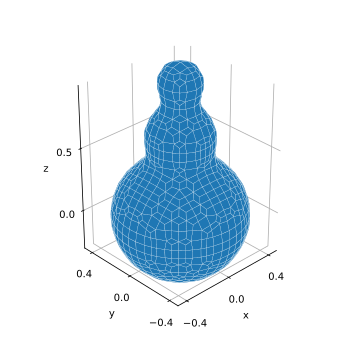
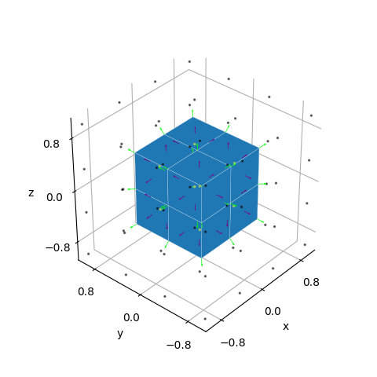

# sdf-surfacenets

This repository provides a vectorized Python implementation of dual methods for the problem of isosurface extraction from signed distance fields (SDF).

Primal methods generate vertices for each edge crossing the surface boundary, while dual methods generate one vertex per voxel. Dual methods generally lead to simpler algorithms and many modern methods are based on the dual approach.

<div align="center">

</div>

The image above shows two reconstructions of a sphere displaced by waves. The reconstruction on the left uses (dual) SurfaceNets from this library, the right side shows the result of applying (primal) Marching Cubes algorithm from scikit-image.

See [examples/compare.py](examples/compare.py) for details.

## Features

-   A generic blueprint algorithm for dual iso-surface generation from SDFs
    -   with implementations of
        -   (Naive) SurfaceNets
        -   Dual Contouring
        -   Midpoint to generate Minecraft like reconstructions
    -   Quad/Triangle topology support
    -   Vertex/Face normal support
-   Tools for programmatically creating and modifying SDFs
-   Plotting support for reconstructed meshes using matplotlib
-   Exporting (STL) of tesselated isosurfaces

## Example Code

```python
# Main import
import surfacenets as sn

# Setup a snowman-scene
scene = sn.sdfs.Union(
    [
        sn.sdfs.Sphere.create(center=(0, 0, 0), radius=0.4),
        sn.sdfs.Sphere.create(center=(0, 0, 0.45), radius=0.3),
        sn.sdfs.Sphere.create(center=(0, 0, 0.8), radius=0.2),
    ],
    alpha=8,
)
# Generate the sampling locations. Here we use the default params
grid = sn.Grid(res=(32, 32, 32))

# Extract the surface using dual contouring
verts, faces = sn.dual_isosurface(
    scene,
    grid,
    strategy=sn.DualContouringStrategy(),
    triangulate=False,
)
```

generates

<div align="center">

</div>

See [examples/hello_dualiso.py](examples/hello_dualiso.py) for details.

## Install

Install with development extras to run all the examples.

```
pip install git+https://github.com/cheind/sdf-surfacenets#egg=sdf-surfacenets[dev]
```

## Examples

The examples can be found in [./examples/](./examples/). Each example can be invoked as a module

```
python -m examples.<name>
```

## Gallery

Here are some additional plots from the library

<div align="center">

</div>
<div align="center">

</div>
<div align="center">

</div>

## References

-   Gibson, Sarah F. Frisken. "Constrained elastic surfacenets: Generating smooth models from binary segmented data." TR99 24 (1999).
-   Ju, Tao, et al. "Dual contouring of hermite data." Proceedings of the 29th annual conference on Computer graphics and interactive techniques. 2002.
-   Naive SurfaceNets: https://0fps.net/2012/07/12/smooth-voxel-terrain-part-2/
-   Signed Distance Fields: https://iquilezles.org/articles/distfunctions/

## Notes (just for me)

-   for a cube, assuming surfae lin when computing ts is not quite right. increase num samples or add a newton root finder. Root finder
    would not work: in case of box you easily have zero grads in the edge direction.
-   biasing for plane parallel xy is needed, otherwise no location info.
-   naive method might shrink object (two edge case)
