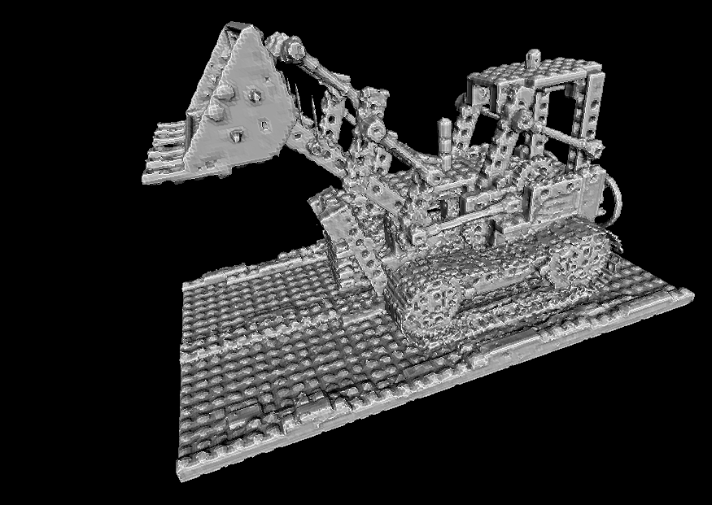
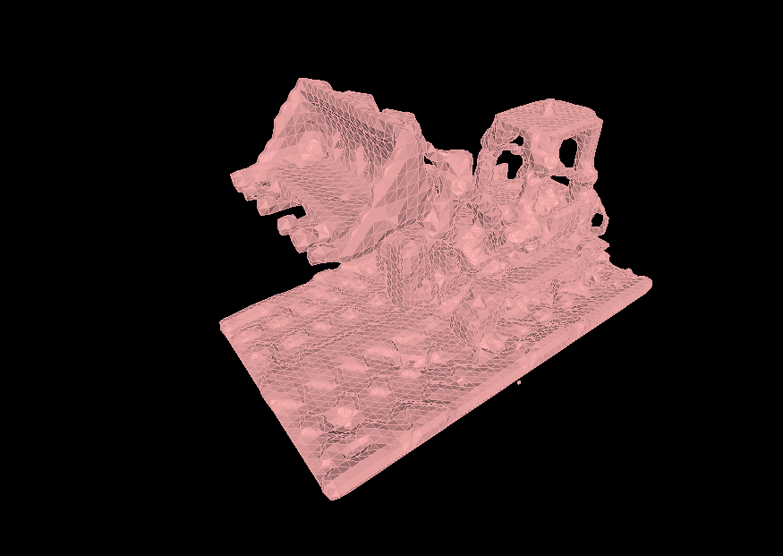
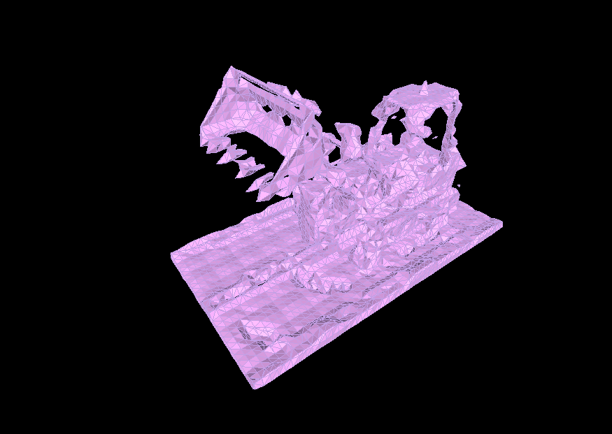

# sdftoolbox

This repository provides vectorized Python methods for creating, manipulating and tessellating signed distance fields (SDFs). This library was started to investigate variants of dual isosurface extraction methods, but has since evolved into a useful toolbox around SDFs.

<div align="center">

</div>

The image above shows two reconstructions of a sphere displaced by waves. The reconstruction on the left uses (dual) SurfaceNets from this library, the right side shows the result of applying (primal) Marching Cubes algorithm from scikit-image.

See [examples/compare.py](examples/compare.py) for details and [doc/SDF.md](doc/SDF.md) for an in-depth documentation.

## Features

-   A generic blueprint algorithm for dual iso-surface generation from SDFs
    -   providing the following vertex placement strategies
        -   (Naive) SurfaceNets
        -   Dual Contouring
        -   Midpoint to generate Minecraft like reconstructions
    -   providing the following edge/surface boundary intersection strategies
        -   Linear (single step)
        -   Newton (iterative)
        -   Bisection (iterative)
-   Mesh postprocessing
    -   Vertex reprojection onto SDFs
    -   Quad/Triangle topology support
    -   Vertex/Face normal support
-   Tools for programmatically creating and modifying SDFs
-   Importing volumetric SDFs from NeRF tools such as [instant-ngp](https://www.google.com/search?channel=fs&client=ubuntu-sn&q=instant-ngp) and [NeuS2](https://github.com/19reborn/NeuS2)
-   Inline plotting support for reconstructed meshes using matplotlib
-   Exporting (STL) of tesselated isosurfaces

## Documentation

Algorithmic ideas, mathematical details and results are discussed in [doc/SDF.md](doc/SDF.md).

## Example Code

```python
# Main import
import sdftoolbox

# Setup a snowman-scene
snowman = sdftoolbox.sdfs.Union(
    [
        sdftoolbox.sdfs.Sphere.create(center=(0, 0, 0), radius=0.4),
        sdftoolbox.sdfs.Sphere.create(center=(0, 0, 0.45), radius=0.3),
        sdftoolbox.sdfs.Sphere.create(center=(0, 0, 0.8), radius=0.2),
    ],
)
family = sdftoolbox.sdfs.Union(
    [
        snowman.transform(trans=(-0.75, 0.0, 0.0)),
        snowman.transform(trans=(0.0, -0.3, 0.0), scale=0.8),
        snowman.transform(trans=(0.75, 0.0, 0.0), scale=0.6),
    ]
)
scene = sdftoolbox.sdfs.Difference(
    [
        family,
        sdftoolbox.sdfs.Plane().transform(trans=(0, 0, -0.2)),
    ]
)

# Generate the sampling locations. Here we use the default params
grid = sdftoolbox.Grid(
    res=(65, 65, 65),
    min_corner=(-1.5, -1.5, -1.5),
    max_corner=(1.5, 1.5, 1.5),
)

# Extract the surface using dual contouring
verts, faces = sdftoolbox.dual_isosurface(
    scene,
    grid,
    vertex_strategy=sdftoolbox.NaiveSurfaceNetVertexStrategy(),
    triangulate=False,
)
```

generates

<div align="center">

</div>

See [examples/hello_dualiso.py](examples/hello_dualiso.py) for details.

## Install

Install with development extras to run all the examples.

```
pip install git+https://github.com/cheind/sdf-surfacenets#egg=sdf-surfacenets[dev]
```

## Examples

The examples can be found in [./examples/](./examples/). Each example can be invoked as a module

```
python -m examples.<name>
```

### Mesh from NeRF

This library supports loading SDFs from density fields provided by various NeRF implementations (instant-ngp and NeuS2). These discretized SDF fields can then be manipulated/triangulated using **sdftoolbox** routines.

The following image shows the resulting triangulated mesh from the Lego scene generated by **sdftoolbox** from an instant-ngp density image atlas.



Command

```shell
python -m examples.nerf2mesh        \
    -r 256 -t 4.0 -o -1.5 -s 0.0117 \
    --sdf-flip                      \
    doc/nerf/density.png

# Use 'python -m examples.nerf2mesh --help' for more options.
```

Note, meshes generated by **sdftoolbox** seem to be of better quality than those generated by the respective NeRF tools. The following compares a low-res reconstruction (res=64,drange=1) of the same scene

|        sdftoolbox         |           NeuS2           |
| :-----------------------: | :-----------------------: |
|  |  |

See https://github.com/19reborn/NeuS2/issues/22 for a discussion

### Gallery

Here are some additional plots from various examples

<div align="center">

</div>
<div align="center">

</div>
<div align="center">

</div>
<div align="center">

</div>

## References

See [doc/SDF.md](doc/SDF.md).
