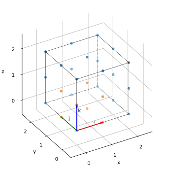
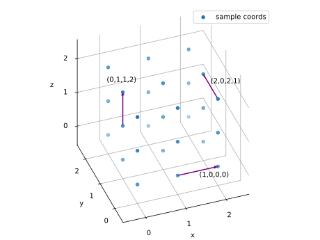
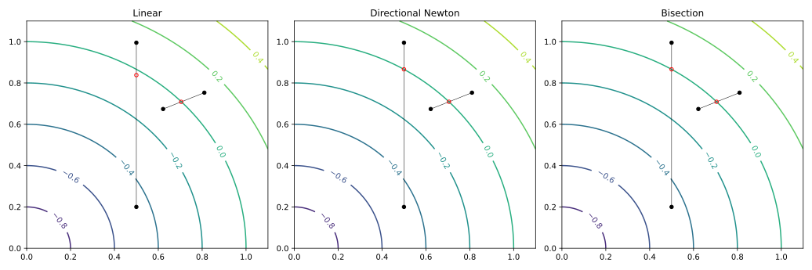
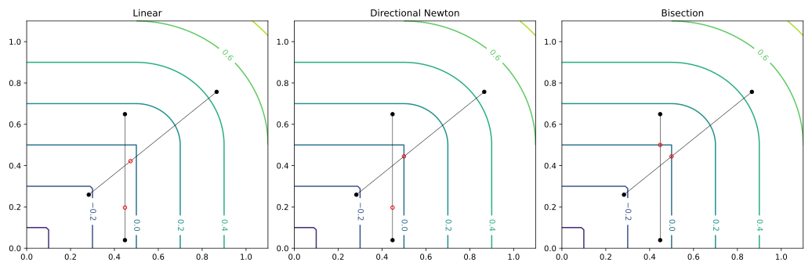
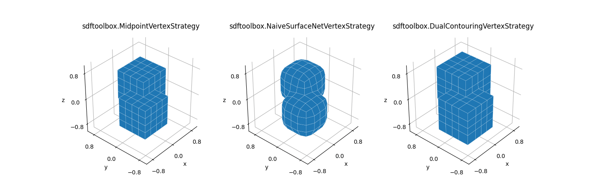
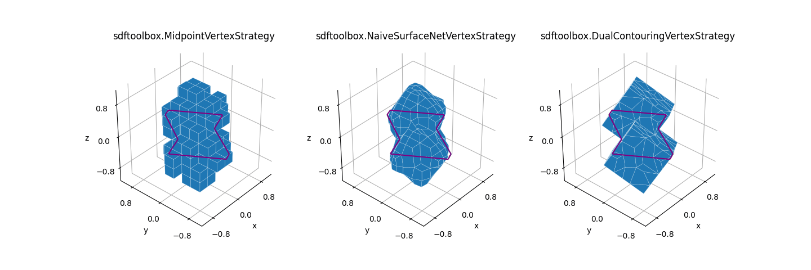

# SDF Documentation

The aim of this document is to provide a documentation of the methods implemented by this library. We limit the discussion to $\mathbb{R}^3$ Euclidean space.

## Signed distance fields

Volumentric data is commonly found in many scientific, engineering, and medical applications. Such volumentric data can be efficiently encoded using [signed distance fields](https://en.wikipedia.org/wiki/Signed_distance_function) (SDFs). A SDF is a vector valued scalar function, $f(x)$, that determines the _signed_ distance from any location to the boundary of the surface encoded by the SDF. By the properties of signed distance, one may classify a location by looking at its SDF value

$$
\begin{cases}
      f(x)>0 & \textrm{outside} \\
      f(x)=0 & \textrm{on the boundary} \\
      f(x)<0 & \textrm{inside}
\end{cases}
$$

Its useful to note that the tuple $(x,f(x))$ can be thought of a sphere centered at $x$ with radius $\mid f(x) \mid$ that touches the closest surface boundary.

Frankly, it does not tell you the contact location, only the distance. Still, this property gives raise to efficient ray maching schemes for visualizing SDF volumes. Another useful property of SDFs: the gradient $\nabla_x f(x)$ points into the direction of fastest increase of signed distance.

For many primitive shapes in $\mathbb{R}^3$ analytic SDF representations are known. Additionally, one can derive modifiers, $g(x, f)$, that transform SDF in useful ways. Modifiers include rigid transformation, uniform scaling, boolean operations, repetition, displacements and many more. See [[2]](#2) for detailed information.

## Isosurface extraction

Isosurface extraction is the task of finding a suitable tesselation of the boundary (or any constant offset value) of a SDF. The methods considered in this library rely a regular SDF sampling volume from which the resulting mesh is generated. The two schemes that dominate the isosurface extraction field differ in the way they generate the tesselated topology. The following table lists the differences:

<table>
  <tr>
    <td></th>
    <td colspan="3">Intersecting grid element</th>
  </tr>
  <tr>
    <th>Method</th>
    <th>Edge</th>
    <th>Face</th>
    <th>Voxel</th>
  </tr>
  <tr>
    <td>Primal</td>
    <td>Vertex</td>
    <td>Edge</td>
    <td>Face(s)</td>
  </tr>
  <tr>
    <td>Dual</td>
    <td>Face</td>
    <td>Edge</td>
    <td>Vertex</td>
  </tr>
</table>

The table above lists, for each type of grid element that intersects the boundary of the SDF surface, which topological element is generated using either primary or dual approaches. For example, first row, second column means that in primal methods a vertex is created for each sampling edge that crosses the SDF boundary. See [[1]](#1) for a more elaborate discussion.

## Coordinate systems

For detailed discussions we need to define the set of coordinate systems involved. These coordinate systems match the implementation of the library.

The following image shows a sampling grid of `(3,3,3)` (blue) points. The sampling coordinates are with respect to the data coordinate system (x,y,z). The sampling points are indexed by a grid coordinate system (i,j,k) that has its origin at the mininium sampling point. Each voxel in the grid is indexed by the integer grid coordinates of its minimum (i,j,k) corner. Note that the next voxel in the i-direction of voxel (i,j,k) is (i+1,j,k).



We index edges by its source voxel index plus a label `e` $\in \{0,1,2\}$ that defines the positive edge direction. The plot below highlights a few edges.



Having three (forward) edges per voxel index allows us to easily enumerate all edges without duplicates and without missing any edges. Note, at the outer positive border faces we get a set of invalid edges (for example `(2,0,2,0)` is invalid, while `(2,0,2,1)` is valid).

## Dual isosurface extraction

This library implements a generic dual isosurface extraction method based. This blueprint allows the user to set different behavioral aspects to implement varios approaches (or hybrids thereof) proposed in literature.

Given a SDF and grid defining the sampling locations, the basic dual isosurface algorithm works as follows

1.  Active edges: For each edge in the sampling grid, determine if it intersects the boundary of the SDF. We call those edges with intersections _active_ edges.
1.  Edge intersection: For each active edge find the intersection point with the boundary of the surface along the edge.
1.  Vertex placement: For each grid (active) voxel with at least one active edge, determine a single vertex location.
1.  Face generation: For each active edge create a quadliteral connecting the vertices of the four active voxels sharing this active edge.

See [[3]](#3),[[1]](#1) for more information.

The library implements this recipe in vectorized form. That is, all steps of the algorithms are capable to work with multiple elements at once. This allows for a better resource usage and generally speeds up algorithmic runtime dramatically. It is also the reason that you will hardly find for-loops sprinkled all over the code.

The recipe above gives raise to different behavioral aspects that are implemented as exchangable modules:

-   _edge strategies_: determines how the intersection between an edge and the surface boundary as dictated by the SDF is found.
-   _vertex strategies_: determines how the vertex from the voxel's active edges is computed.

### Edge strategies

Edge strategies implement different methods to determine the edge/surface crossing. The following strategies are implemented

#### Linear (single-step)

This method determines the intersection by finding the root of a linear equation guided by the SDF values at the two edge endpoints. This is most commonly found method in literature. It makes the following two assumptions

1. Surface Smoothness: the SDF is assumed to be smooth
1. Small edges: the edge lengths are supposed to be small compared to size of the shape of the SDF

Together, this two assumptions lead to linearity of the surface close to edges. Hence, modelling the surface boundary using a linear equation leads to accurate estimations. Also, in case you do not have access to analytic SDFs (e.g discretized volume of SDF values) it is the best you can do.

#### Newton (iterative)

If the assumptions of the linear strategy are wrong, this leads to misplaced intersections that affect the quality of the final mesh. If you happen to have access to an analytic SDF, you might do better: We drop the assumption of surface linearity and instead find the root of the SDF along the edge iteratively. One algorithm with quadric convergence is Newton's method (it requires access to the gradient of the SDF). For our usecase (vector valued scalar function) we need a variant of it, the so called directional Newton method.

#### Bisection (iterative)

The bisection method is useful when a) linearity is not given, b) you have access to an analytic SDF and c) the gradient does not convey information along the edge direction (e.g. for some points in the SDF of a box).

#### Edge strategies evaluation

Here is a diagram comparing the edge strategies on a spherical cross-section.

<div align=center>
      
      <figcaption>Comparison of different edge intersection strategies on the cross section of an analytic sphere SDF. Each plot shows the same two edges and marks the intersection point (red circle) as determined by the respective method.</figcaption>
      
</div>
<br>

One notices, that for the linear estimator only the smaller edge seems to yield an accurate fit. For the larger edge, the main assumptions of the linear method break and hence the estimated root is off. Newtons method as well as the bisection method do not expose this issue at the cost of additional computational steps.

Shown below, is a similar plot for the cross section of a box.

<div align=center>
      
      <figcaption>Comparison of different edge intersection strategies on the cross section of an analytic box SDF. Each plot shows the same two edges and marks the intersection point (red circle) as determined by the respective method.</figcaption>  
</div>
<br>

The linear method fails for both edges because its main assumptions are violated. For Newton's method, the intersection for only one of the edges is computed correctly. No intersection is found for the other edge, since the gradient is orthogonal to the edge direction (no information along the edge dir). Only the bisection method is capable for producing an accurate result for both cases.

### Vertex strategies

These strategies determine the final vertex locations active voxels.

#### Midpoint

The simplest strategy that places the vertex in the center the voxel. The resulting meshes are Mincraft-like box worlds.

#### (Naive) SurfaceNets

Naive SurfaceNets [[1]](#1) determine the the voxel's vertex location as the centroid of all 12 active edge intersection points. This strategy works well in practice but has the following downsides: a) it cannot reproduce sharp features like corners (like primal Marching Cubes [[4]](#4)) and b) its prone to shrink the surface in regions of sharp
features.

#### Dual Contouring

Dual Contouring [[5]](#5) attempts to restore sharp features by determining the vertex position as the point that has the maximum support from all active edges of the voxel. Consider the plane formed by an active edge intersection point $q_i$ and its associated normal $n_i$. Any vertex location that is on that plane is compatible with it. In general, more than one plane is active for each voxel and point of maximum support is the one that lies on all the planes. This gives raise to a system of linear equations (each of the form $n_i^Tx=n_i^Tq_i$ for the unknown point $x$), for which we find a least squares solution in practice.

Additionally, many edge configurations convey too little information to uniquely determine the location (as an example consider a xy-plane intersecting the four k-directed voxel edges). These configurations lead to an underdetermined system of linear equations. This is solved by adding additional equations (multi objective linear least squares) that directly encode a preferred vertex location. We give these additional equations little weight, so that they only take over when the system is otherwise truly underdetermined.

#### Vertex strategies evaluation

The following plot compares the three vertex placement strategies using the SDF of a union of two (offsetted) axis aligned boxes given by

```python
boxes = sdftoolbox.sdfs.Union([
      sdftoolbox.sdfs.Box().transform(trans=(0.5, 0.5, 0.5)),
      sdftoolbox.sdfs.Box(),
]).transform(trans=(-0.25, -0.25, -0.25))
```

We use a low resolution grid of resolution `10x10x10`.

<div align=center>
      
      <figcaption>Comparison of different vertex placement strategies using an analytic SDF formed by two offsetted but axis aligned boxes. Each plot shows the isosurface extraction result of the corresponding method labelled on top of the plot. For orientation, the true isocontour of the cross section at z=0 is shown in purple.
      <figcaption>  
</div>
<br>

Since the boxes are aligned with the world coordinate system, the midpoint strategy generates visually pleasing reconstruction. However, due to the placement of the vertices in the voxel centers, the resulting surface model has too little volume. Similarily, the naive SurfaceNets variant deforms the shape of the model due to a contraction of the average. This causes a loss of sharp features and a shape volume that is too small. Only the Dual Contouring strategy is capable of reconstructing sharp features and placing the vertices at locations that give rise to a volumetric matching reconstruction.

Shown below are the reconstructions of the same boxes, but this time rotated around the axis `(1,1,1)` by 45°.

<div align=center>
      
      <figcaption>Comparison of different vertex placement strategies using an analytic SDF formed by two offsetted and rotated boxes. Each plot shows the isosurface extraction result of the corresponding method labelled on top of the plot. For orientation, the true isocontour of the cross section at z=0 is shown in purple.
      <figcaption>  
</div>
<br>

This time the midpoint placement strategy fails to capture the shape of the object (like aliasing effects in rendering). The naive SurfaceNets method has the same issues as in the aligned case (non sharp features, volume contraction). The Dual Contouring method manages to capture the shape correctly but induces a few non-manifold vertices (hard to see from the plot).

## References

-   <a id="1">[1]</a>
    mikolalysenko. https://0fps.net/2012/07/12/smooth-voxel-terrain-part-2/
-   <a id="2">[2]</a>
    Inigio Quilez's.
    https://iquilezles.org/articles/distfunctions/
-   <a id="3">[3]</a> Gibson, Sarah FF. "Constrained elastic surface nets: Generating smooth surfaces from binary segmented data." International Conference on Medical Image Computing and Computer-Assisted Intervention. Springer, Berlin, Heidelberg, 1998.
-   <a id="4">[4]</a>Lorensen, William E., and Harvey E. Cline. "Marching cubes: A high resolution 3D surface construction algorithm." ACM siggraph computer graphics 21.4 (1987): 163-169.
-   <a id="5">[5]</a> Ju, Tao, et al. "Dual contouring of hermite data." Proceedings of the 29th annual conference on Computer graphics and interactive techniques. 2002.
